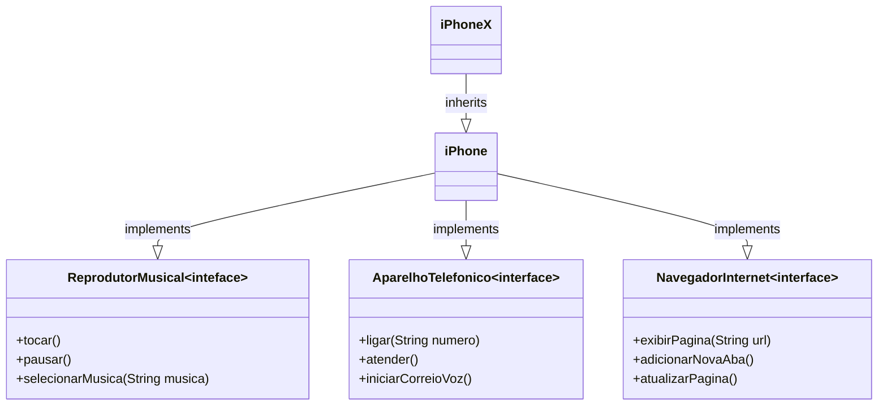

## Exemplo de Diagrama UML

```mermaid
classDiagram
    class ReprodutorMusical~inteface~ {
        +tocar()
        +pausar()
        +selecionarMusica(String musica)
    }

    class AparelhoTelefonico~interface~ {
        +ligar(String numero)
        +atender()
        +iniciarCorreioVoz()
    }

    class NavegadorInternet~interface~ {
        +exibirPagina(String url)
        +adicionarNovaAba()
        +atualizarPagina()
    }

    class iPhone {
    }
    
    class iPhoneX {

    }

    iPhone --|> ReprodutorMusical : implements
    iPhone --|> AparelhoTelefonico : implements
    iPhone --|> NavegadorInternet : implements
    iPhoneX --|> iPhone : inherits
```
